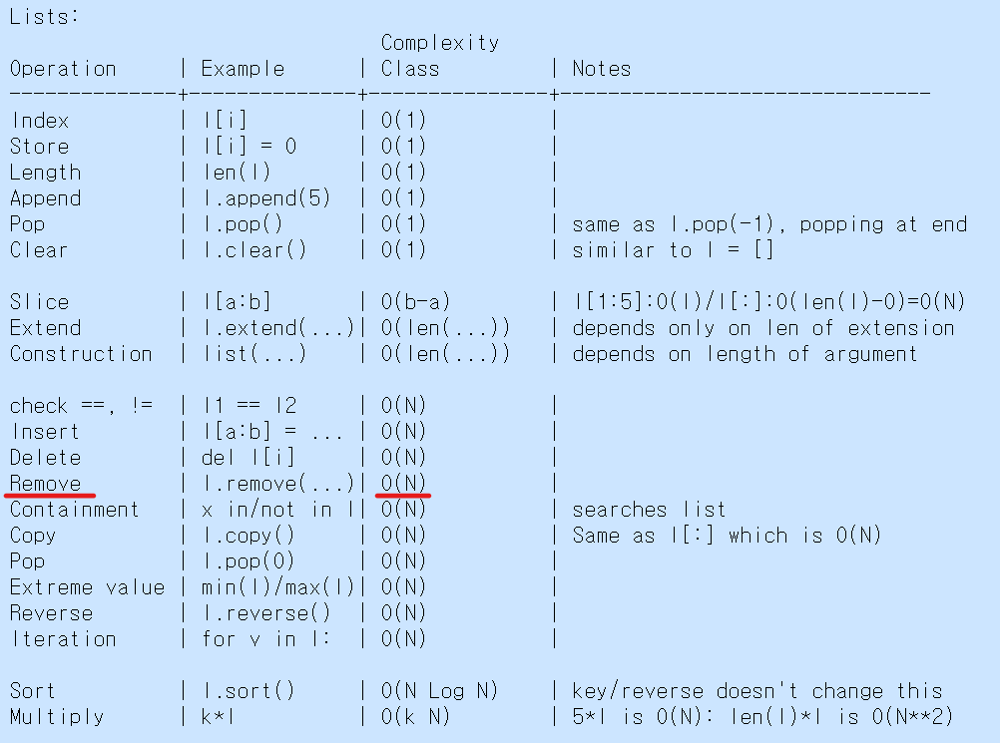

### 문제 1.
#### 문제 내용
문자열을 원소로 하는 두 개의 배열(배열1, 배열2)이 있다. 어떤 원소가 배열 1에 포함되나 배열2에 포함되지 않고, 이런 원소가 1개 존재한다고 할 때, 해당 원소를 출력하여라. (단, 배열1,2 에는 중복된 원소가 포함될 수 있으며, 중복원소의 갯수가 배열1에서 보다 배열2에서 더 적을때, 포함되지 않는 것으로 한다.)

#### 문제 분석
구하는 것 :  어떤 원소의 출력

자료 : 배열1, 배열2

조건: 
1. 어떤 원소는 배열1에는 포함되지만 배열2에는 포함되지 않는다.
2. 어떤 원소가 중복되어 포함되는 경우 배열1에 포함된 갯수가 배열2에 포함된 갯수보다 1개 많다

#### 풀이 계획
#### 계획1.
- 배열2의 원소에 대한 반복문을 작성한다. 
- 배열1에서 반복문의 변수가 원소로 존재하는 경우 해당 원소를 삭제한다.
- 마지막 남은 한개를 출력한다.

#####  실행.

	for element in arr2 :
		arr1.remove(element)
	print(arr1[0])

#####  실패.
- 배열의 크기가 큰 경우, 알고리즘을 수행하는 시간이 기준치 보다 오래 걸렸다.   

##### 문제점.
- 배열에서 하나의 원소를 삭제할 때 기본 연산의 횟수는 배열의 원소갯수에 비례한다.
- 배열2의 원소 갯수를 n 개라 하면 총 기본 연산의 횟수는 n^2이 된다. (삭제를 n 번 수행)
- 데이터 갯수의 제곱에 비례하여 연산 시간이 증가 하게 된다.
- python list 연산들의 시간복잡도

	
#### 계획 2.
- 배열1과 배열2를 오름차순으로 정렬한다.
- 배열1과 배열2의 원소를 index에 따라 순차적으로 비교한다. 
- 동일한 index에서 두 배열의 원소가 같지 않다면 이때, 결과를 출력한다. 

##### 실행.

	answer = ''
	arr1.sort()
	arr2.sort()
	for i in range(len(arr1)) :
		if i == len(arr1) - 1 or arr1[i] != arr2[i] :
			answer = arr[i]
			break
	print(answer)

##### 성공.
- 배열의 크기가 큰 경우에도 기준치 이내의 수행시간으로 통과하였다.

##### 원인분석.
- 정렬의 경우 알고리즘에 따라 시간복잡도가 n^2 보다 작아지는 것들이 있다. 
- 정렬의 연산 횟수를 n * logn 이라고 할때, 최악의 경우 총 연산 횟수는 2 n * log n  + n 이 된다. 

### 문제2. 프로그래머스 체육복
##### 풀이 문제점 1. 

	for number in lost :
		if exist(reserve, number) :
			lost.remove(number)

위와 같은 코드에서 number를 lost에서 지우고 다음 순서로 이동할 경우 하나가 누락되는 문제가 생김.

##### 풀이 문제점 2.
파이썬 예약어 in 의 적절한 활용. list 에서 특정 원소의 존재 여부에 따라 True, False를 반환한다. 

	testArray = [1, 2, 3, 4, 5]
	existence = 2 in testArray
		
### 문제3. 프로그래밍 과제 2-1(homework/프로그래밍과제2.pdf)
- 문제분석
	- 자료: 오름차순으로 정렬된 N개의 수,  K
	- 구하는 것: 어떤 정수쌍의 갯수
	- 조건: 어떤 정수쌍의 합이 K가 된다.
- 풀이 계획1.
	- 풀이 전략
		- 자기 반복의 대상을 찾는다.
		- 순환 단계 별로 무엇을 변하게 할 것인지 설계한다.
		- 어떤것을 base case 로 할지 정한다.
		- 어떤것을 recursive case 로 할지 정한다.
	- 풀이 설계
		- 구하는 것인 정수쌍의 갯수를 자기 반복의 대상으로 잡는다.
		- 순환 단계 별로 자료의 갯수가 작아지도록 설계한다.
		- 자료의 갯수가 0이 될때, base case
		- 양끝 정수의 정수쌍의 합과 K를 비교하여 다음과 같이 나누고 자료의 갯수를 바꾸어  재귀 호출 한다.
			- K 보다 작을 경우
			- K 와 같을 경우
			- K 보다 클 경우
	- 풀이 실행
		- 코드 참조

### 문제4. 프로그래밍 과제 2-2
- 문제 분석
	- 구하는 것: 어떤 수
	- 자료: 오름차순으로 정렬된 n 개의 정수, 정수 K 
	- 조건:
		- 어떤 수는 n 개의 정수 중 하나
		- 어떤 수는 K보다 크거나 K와 같은 수들 중 가장 작다.
		- 알고리즘의 시간 복잡도가 O(logN)이 되도록
- 풀이 전략
	- 단계마다 자료의 갯수가 절반으로 줄어드는 이진 탐색과 같은 알고리즘 필요.
	- 이진 탐색 알고리즘을 사용
- 풀이 실행
	- 코드 참조       	
