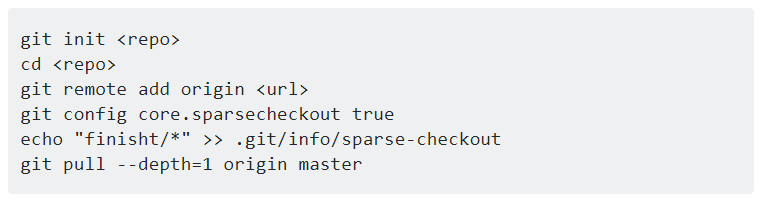

## 진행 방향
- 기본 적인 자료구조 부터 코딩 테스트에서 자주 출제되는 알고리즘 파트 까지 학습.
- 이론과 문제풀이를 병행하여 진행 하되, 문제풀이에 집중.
- 이론과 병행하여 프로그래머스(programmers.co.kr)의 자료구조, 알고리즘 문제를 해결.
- 이론은 공통강의를 선정하여 듣고,  자세한 내용은 각자 기본서를 통해 학습. 

## 진행 세부 사항
- 오프라인 모임 : 매주 목요일 7시, 장소는 유동적 (커피랑도서관, 서현도서관, 투썸플레이스 등)
- 온라인
	- 매주 월요일 개념 정리 올리는 날.
	- 매주 수요일 문제 풀이 과정 및 결과 올리는 날.

## 1주차 일정
- [x] 8 / 10 공통으로 들을 온라인 강의 선정 
- [x] 8 / 12 재귀 이론 공부 내용 업로드
- [x] 8 / 14  프로그래머스 레벨 1 테스트 문제 풀이 과정/ 결과 업로드 

## 2주차 일정
- [ ] 8 / 19 // 강의 업로드 내용 결정 필요
- [ ] 8 / 21 https://www.hackerrank.com -> Algorithms -> subdomain = recursion(회원가입 후 테스트 문제 풀어야 보임) 에서 난이도 **medium** 문제들을 골라 풀어서 풀이 업로드.  
  - 프로그래머스에 재귀 부분이 따로 분류되어있지 않아 해커랭크로 대안을 골랐습니다

## 특정 폴더만 pull, push 하는 방법

https://stackoverflow.com/questions/600079/how-do-i-clone-a-subdirectory-only-of-a-git-repository

