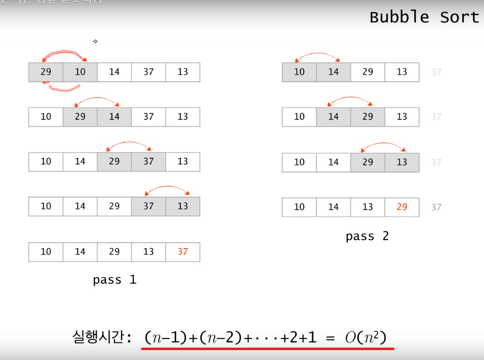
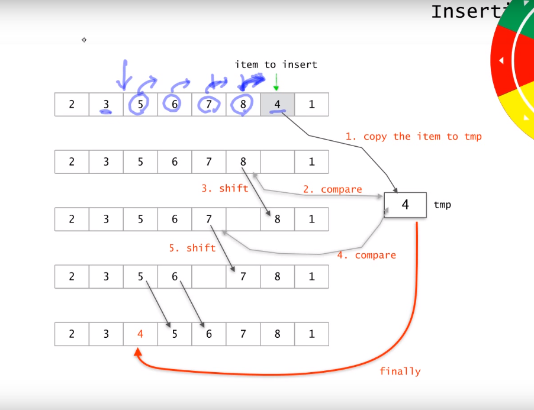

## 기본적인 정렬 알고리즘
### 1. selection sort
#### selection sort 의 logic (오름차순)
- 하나의 list를 정렬
- step1. 각 단계에서 list의 수 중에서 최댓값을 찾는다
- (step2. 최댓값과 마지막 칸의 숫자를 교환한다.
- step3. 마지막 칸을 제외한 나머지 숫자들에 대해서 step2, step3 를 반복한다.
- step4. 남은 숫자가 하나일때까지 계속한다.

#### selection sort 의 시간복잡도
- 각단계의 연산은 step1, step2.
- 배열의 갯수가 n 개인 단계 일떄, 기본연산의 횟수
	- step1은 최댓값을 찾는 연산, 기본연산은 비교, 비교횟수는 n - 1 회
	- step2는 교환 연산 교환 연산의 횟수는 상수번 k 회
- 초기 list의 데이터수가 n개라고 할때, 기본연산의 총 횟수
```
(n - 1) + (n - 2) + (n - 3) + ... + 1 + k(n - 1) = (n)(n-1)/2 + k(n - 1) => O(n^2)
```
### 2. bubble sort
#### bubble sort의 시간복잡도


- 각 단계의 기본연산은 교환
- n개의 데이터가 남아있을때 연산횟수는 최악의 경우 n-1회
- 총 기본연산의 횟수
```
(n - 1) + (n - 2) + (n - 3) + ... + 1 = n(n - 1)/2 => O(n^2)
```

### 3. insertion sort
#### insertion sort 의 로직
- k 번째 단계에서 앞 k-1개의 수는 모두 바르게 정렬되어 있다.
- k 번째 숫자를 앞의 k-1개의 숫자들과 각각 비교하여 알맞은 위치에 insert한다.



#### insertion sort 의 시간복잡도
- k 번째의 단계를 상정
- 앞의 숫자는 정렬되어 있기 때문에,  비교의 순서에 따라서 비교 횟수를 줄이는 것이 가능 -> 뒤에서 부터 비교한다.
- 기본연산은 비교와 교환
- 최악의 경우 k -1 회의 비교와 k-1회의 교환이 일어날 수 있다. 
- 데이터가 n개일 경우 총 단위연산의 횟수
```
(n - 1) + (n - 2) + (n - 3) + ... + 3 + 2 + 1 = n(n - 1)/2 => O(n^2)
```

#### 세가지 정렬방법의 시간 비교
- insertion sort 의 경우 selection sor나 bubble sort와 다르게 비교 연산이 항상 고정된 횟수로 일어나지 않는다.
- insertion sort 가 다른 두 정렬 알고리즘에 비해 시간적으로 유리하다.

