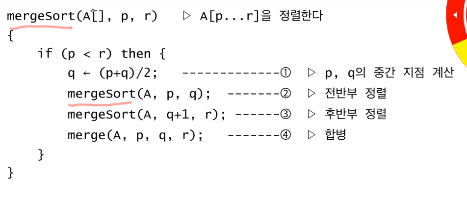
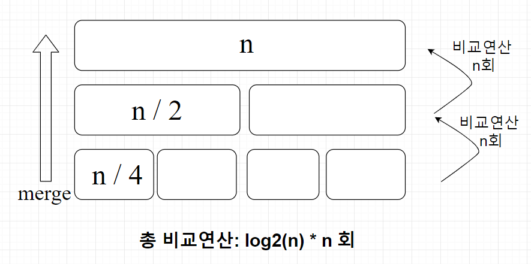

## merge sort
### 1. 분할정복법 - merge sort의 주된 idea


- 원래 문제를 **동일한** 작은 문제들로 **분할**한다.
- **분할**된 작은 문제들을 계산(해결)한다.
- 계산(해결)된 결과를 **병합**한다.

### 2. merge sort algoritm pseudo code


- step1. 반으로 쪼갠다. 
- step2. 각각에 대하여 정렬 함수를 호출한다.(recursive)
- step3. 결과를 합병한다.

### 3. mergesort 시간 복잡도 계산
#### 3 - 1. 수학적 계산
```python
def mergesort(start, end, targetList):
	if start < end:
		middle = int((start + end) / 2)
		mergesort(start, middle, targetList) # 전반부 정렬 -> T(n/2)
		mergesort(middle + 1, end, targetList) # 후반부 정렬 -> T(n/2)
		merge(start, middle, end, targetList) # 합병 -> n
```
##### T(n) 의 일반항을 구해서 시간복잡도를 계산
```
T(n) =  2 * T(n / 2) + n
```

### 3 - 2. 직관적 계산


- 데이터의 갯수가 n 개일때 총 log2(n) 단계
- 각단계별로 합병은 n 개의 데이터에 일어남 -> n회 비교연산
- 총 연산의 횟수는 n * log2(n)

```
								O(n) = log(n) * n
```

