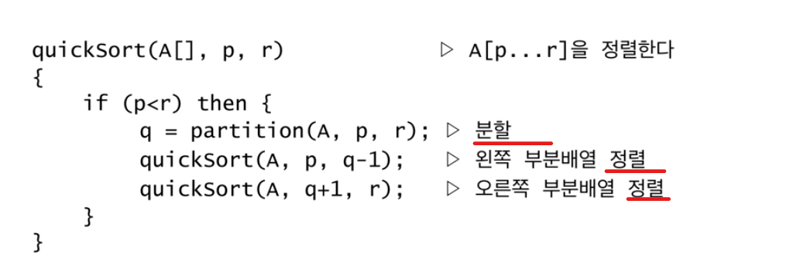
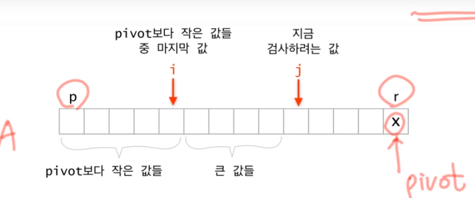

# Quicksort
## 1. 분할 정복법
- 분할 -> 정복 -> 합병
- 분할
	- 전체 원소 중 pivot을 하나 선정해서 pivot 보다 작은 부분과 큰 부분으로 전체를 나눈다. 
- 정복
	- 각각을 정렬한다. 

## 2. quicksort algorithm
- 분할 -> 각각의 정복(정렬)


###  분할  알고리즘
- pivot을 고른다
- pivot 보다 작은 값들을 골라서 전반부로 나눈다.
- pivot 보다 큰 값들을 골라서 후반부로 나눈다. 



### 분할 알고리즘 구현

```python
def divide(pivot, array):
    i = 0
    j = 0
    while j < len(array) - 1:
    	if array[j] < array[pivot]:
        	temp = array[j]
        	array[j] = array[i]
        	array[i] = temp
        	i += 1
        	j += 1
    	else:
        	j += 1
    temp = array[pivot]
    array[pivot] = array[i]
    array[i] = temp
```

## 4. quicksort의 시간복잡도 
### 최악의 경우 시간복잡도 
- 항상 한쪽은 0개 다른 한쪽은 n 개로 분할 되는 경우
- 이미 데이터가 정렬되어 있는 경우 이러한 시간복잡도가 된다
```
T(n) = T(n - 1) + O(n)
	 = O(n^2)
```
### 항상 절반으로 분할되는 경우
```
T(n) = 2 * T(n / 2) + O(n)
	 = O(n * log(n))
```

### 평균 시간복잡도
- 평균 시간복잡도는 가능한 전체 입력에 대해 각 입력의 확률과 각입력에 대한 시간복잡도의 곱의 합으로 나타낼 수 있다.
```
A(n) = sum(P(I) * T(I))
```

- n개의 배열이 입력으로 들어올때, 수학적인 확률은 1 / n! 로 생각해 볼 수 있다
	- 해당 배열의 경우의수 / 전체 배열의 경우의 수

### 어떤 값을 pivot으로 선택할 것인가
- 처음값, 끝값
- 처음 끝 중간의 median of three
- random

### 구현
- 정렬: code/quicksort.py
- 분할: code/ quicksortDivide.py