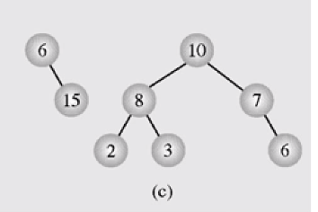

## Heap sort

### 기본 용어 이해
- Tree
	- binary tree : 트리의 각 노드가 최대 2개의 자식 노드를 가질 수 있는 트리
		- 주의. 자식 노드가 한 개 있는 경우에도  좌에 있는 자식노드와 우에 있는 자식노드는 다르다. 		
	- full binary tree : 모든 레벨에서 노드가 꽉 차 있음.
	- complete binary tree : 마지막 레벨을 제외하면 노드가 꽉 차 있음.

- Heap
	- 조건
		1. complete binary tree
		2. heap property
	- heap property
    	- max heap: 부모는 자식보다 크거나 같다.
		- min heap: 부모는 자식보다 작거나 같다.
	- heap의 조건을 만족하지 않는 경우 -> 우측이 빠진 경우는 만족.  
		 

### Heap의 일차원 표현
- 논리적 구조
  - complete binary tree의 논리적 구조를 list의 일차원 구조로 저장.
- 일차원 구조(A)에서 부모, 자식 index 찾기 -> A[i]
  - 부모: [i / 2]
  - 자식: 2 * i , 2 * i + 1

### max heapify
- max heap property를 만족하도록 해준다.
- 부모 노드에 저장된 값이 자식노드의 값들 중 큰 쪽보다 작을 때, 값을 교환한다.