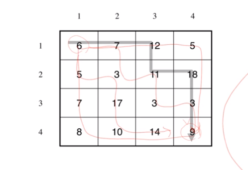

## 동적계획법을 적용하는 문제들

### 들어가기전에
1. **동적 계획법 문제들을 해결하는데 중요한 부분**

표준적인 문제의 해결 과정은 다음과 같습니다.
- 순환식 세우기  ->  순환식을 동적계획기법으로 풀기(top down or bottom up)

많은 문제들에서 순환식이 주어져있지 않고, 일단 순환식을 세워놓고 난 이후라고 하면 기계적으로 방법론이 적용되는 측면이 있어 **순환식을 옳게 세우는 것**이 문제해결의 가장 큰 열쇠이다 

### 1. 행렬 경로 문제 해결법
- 문제 분석
  - 구하는 것
    - 방문한 경로 상의 숫자 들의 합을 구했을때, 합의 최솟값
  - 자료
    - 경로상의 숫자들
  - 조건
    - 움직이는 방향은 우 또는 하로 제한된다.
    - 좌측 맨 윗 칸에서 부터 우측 맨 아랫칸 까지 진행한다. 



- 문제 해결
  - 경우를 제한하기 방법 -> **이거 아니면 이거 밖에 없다 방법**
  	- L[i, j] : (1, 1) 부터 (i, j) 까지 이동할때 최솟값
  	- L[i, j] = L[i, j - 1] + m[i, j] or L[i - 1, j] + m[i, j]
  	- L[i, j] = min(L[i - 1, j], L[i, j - 1]) + m[i, j]  -> **완성!**

### 2. 행렬 경로 문제 풀이
```python
Row = 4
Col = 4
X = 100000
m = [
    [X, X, X, X, X],
    [X, 6, 7, 12, 5], 
    [X, 5, 3, 11, 18], 
    [X, 7, 17, 3, 3], 
    [X, 8, 10, 14, 9]
]

L = [[-1 for i in range(Col + 1)] for j in range(Row + 1)]

for i in range(Col + 1):
  L[0][i] = X
for i in range(Row + 1):
  L[i][0] = X

L[1][1] = m[1][1]

def calL(i, j):
  if L[i][j] == -1:
    L[i][j] = min(calL(i - 1, j), calL(i, j - 1)) + m[i][j]
  return L[i][j]

```

### 3. 행렬 경로 문제 풀이 #2

- 합의 최솟값 뿐만 아니라, 합이 최소가 되는 경로도 구해보자.

```python

def pathFind(i, j):
  print(i, j)
  p[i][j] = 0
  if L[i][j - 1] < L[i - 1][j]:
    pathFind(i, j - 1)
  elif L[i][j - 1] > L[i - 1][j]:
    pathFind(i - 1, j)
  if i == 1 and j == 1:
    return

calL(4, 4)
pathFind(4, 4)
for row in p:
  print(row)
```


